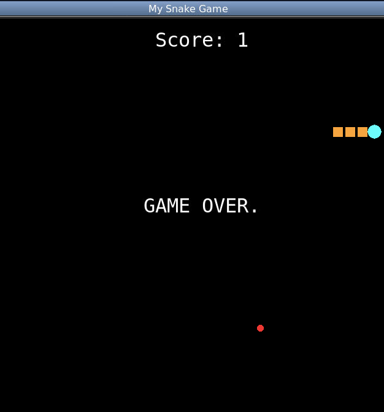

# My Snake Game

Snake Game made using Python.

## Table of contents
- [Overview](#overview)
  - [Screenshot](#screenshot)
  - [Links](#links)
- [My process](#my-process)
  - [Built with](#built-with)
  - [What I learned](#what-i-learned)
  - [Useful resources](#useful-resources)
- [Author](#author)
- [Acknowledgments](#acknowledgments)

## Overview

### Screenshot

### Links
- Press Play Button after visiting this Site: [My Snake Game](https://replit.com/@theyashviradia/mysnakegame?embed=1&output=1#main.py)

## My process

### Built with

- Python 3
- Tkinter Module

### What I learned
- Object Oriented Programming
- Aspects of developing basic game using Python

### Useful resources
- [Stack Overflow](https://stackoverflow.com/)
- [Google](https://www.google.com/)

## Author

- Website - [Yash Viradia](http://yashviradia.tech/)
- Twitter - [@theyashviradia](https://twitter.com/theyashviradia)

## Acknowledgments
- LondonAppBrewery - [LondonAppBrewery](https://www.londonappbrewery.com/)